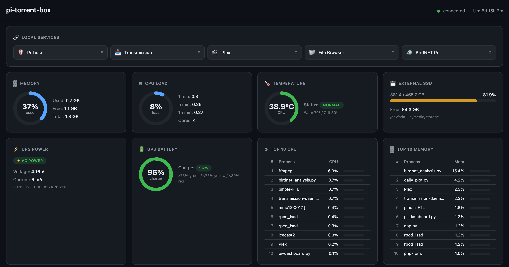

# Pi Dashboard

Lightweight web dashboard for Raspberry Pi system monitoring. A single Python file serves a dark-themed UI with live metrics — no build step, no frontend framework.



**Web UI:** `http://<pi-ip>:8585`  
**API:** `http://<pi-ip>:8585/api/stats`

## Features

- **Local Services** — quick links to Pi-hole, Transmission, Plex, File Browser, BirdNET Pi (editable in `pi-dashboard.py`)
- **Memory** — used / free / total with gauge
- **CPU** — load averages (1m, 5m, 15m) normalized to core count
- **Temperature** — CPU temp with normal / warning / critical thresholds
- **Disk** — usage for an external SSD mount (configurable)
- **UPS** — power source and battery level (reads `/run/ups_status.json` when available)
- **Top processes** — top 10 by CPU and memory
- Auto-refreshes every 5 seconds; responsive grid layout

UPS data is optional. If `/run/ups_status.json` is missing, the UPS cards show *unavailable*. That file is typically written by a separate UPS monitor service (e.g. [Waveshare UPS HAT monitor](https://github.com/pR13S7/PiDashboard#ups-integration)).

## Requirements

- Raspberry Pi (or any Linux host) with Python 3
- [Bottle](https://bottlepy.org/) — the only Python dependency

## Quick install (Raspberry Pi)

Run on the Pi as root. This creates a venv at `/opt/pi-dashboard`, installs Bottle, and registers a systemd service:

```bash
git clone git@github.com:pR13S7/PiDashboard.git
cd PiDashboard
sudo bash INSTALL.sh
```

After install:

```bash
sudo systemctl status pi-dashboard
sudo journalctl -u pi-dashboard -f
```

Open `http://<pi-ip>:8585` in a browser.

## Manual run (development)

```bash
pip3 install -r requirements.txt
python3 pi-dashboard.py
```

Press `Ctrl+C` to stop.

## Configuration

Edit the constants at the top of `pi-dashboard.py`:

| Setting | Default | Description |
|---------|---------|-------------|
| `PORT` | `8585` | HTTP port |
| `HOST` | `0.0.0.0` | Bind address |
| `REFRESH_INTERVAL` | `5` | UI refresh interval (seconds) |
| `UPS_STATUS_FILE` | `/run/ups_status.json` | UPS status JSON path |
| `DISK_PATH` | `/media/storage` | External disk mount to monitor |
| `TEMP_WARNING` | `70` | CPU temp (°C) — yellow |
| `TEMP_CRITICAL` | `80` | CPU temp (°C) — red |

### Local service links

Links at the top of the dashboard are defined in the `mkServices()` function inside `pi-dashboard.py`. Edit the `services` array to add, remove, or change URLs and icons.

### UPS integration

The dashboard reads UPS status from a JSON file. Example shape:

```json
{
  "on_battery": false,
  "percent": 92,
  "voltage": 4.15,
  "current_ma": 120,
  "timestamp": "2026-05-19 10:00:00"
}
```

Any process that writes this file to `UPS_STATUS_FILE` will populate the UPS cards.

## API

`GET /api/stats` returns all metrics as JSON:

```json
{
  "cpu": {"load_1m": 0.42, "load_5m": 0.38, "load_15m": 0.35, "cores": 4, "percent": 10.5},
  "memory": {"total_mb": 7967, "used_mb": 2100, "available_mb": 5867, "percent": 26.4},
  "temperature": {"celsius": 52.3, "status": "normal"},
  "disk": {"mount": "/media/storage", "total_gb": 931.5, "used_gb": 412.0, "percent": 44.2},
  "uptime": {"text": "3d 12h 5m", "seconds": 306300},
  "ups": {"available": true, "on_battery": false, "percent": 92},
  "top_cpu": [{"pid": 1234, "name": "python3", "cpu": 12.5, "mem": 3.2}],
  "top_mem": [],
  "hostname": "pi",
  "timestamp": "2026-05-19 10:00:00"
}
```

## Systemd service

`INSTALL.sh` installs and enables `pi-dashboard.service`. To manage it manually:

```bash
sudo cp pi-dashboard.service /etc/systemd/system/
sudo systemctl daemon-reload
sudo systemctl enable --now pi-dashboard
```

Default install paths:

- Script: `/opt/pi-dashboard/pi-dashboard.py`
- Virtualenv: `/opt/pi-dashboard/venv/`

## Files

| File | Purpose |
|------|---------|
| `pi-dashboard.py` | Application — metrics, API, and embedded HTML/CSS/JS |
| `INSTALL.sh` | One-shot installer for Raspberry Pi (venv + systemd) |
| `pi-dashboard.service` | Reference systemd unit (INSTALL.sh generates the live unit) |
| `requirements.txt` | Python dependencies |

## License

MIT
